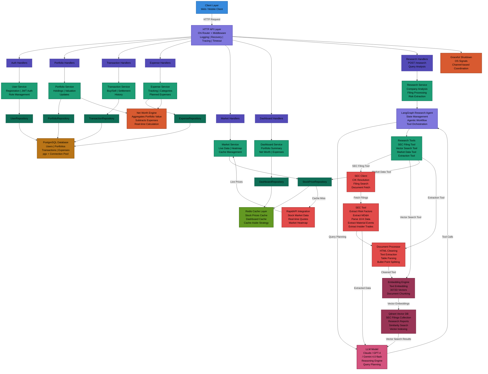

# HEXAFINANCE

A production-grade financial simulation platform: a **Go** backend built on Clean/Hexagonal Architecture, paired with an independent **Python (FastAPI + LangGraph)** multi-agent service that performs autonomous, LLM-driven equity research with a fully deterministic fallback when no LLM is available.
The platform simulates real-world portfolio management, buy/sell transactions, expense tracking, live market data ingestion, technical indicators, net worth analytics, and AI-generated stock research reports backed by SEC filings, financial statements, news, and historical memory.

## The project demonstrates:-
1) Clean Hexagonal Architecture with strict domain separation (handlers → services → repositories, all behind interfaces)
2) RESTful API design using the Chi router, with route groups and URL-param-scoped sub-routers
3) Global middleware for request ID injection, logging, panic recovery, request timeouts, and CORS
4) Redis cache-aside strategy with per-key TTLs tuned per data type, plus pipelined bulk reads for multi-symbol lookups
5) PostgreSQL persistence using pgx with connection pooling, explicit transactions, and atomic upserts
6) Repository pattern for isolated, fully mockable, testable data access
7) Concurrent fan-out price fetching across goroutines, and a goroutine + ticker-driven Server-Sent Events (SSE) endpoint for live price streaming
8) Decimal-precision financial math (`shopspring/decimal`) to avoid floating-point rounding errors in money calculations
9) External stock market API integration via RapidAPI (Yahoo Finance + Indian Stock Exchange), with technical indicators (SMA/RSI)
10) A 7-node LangGraph multi-agent pipeline (news → financials → market → SEC filings → vector retrieval → memory → aggregation) fronted by FastAPI and reverse-proxied through the Go backend
11) Retrieval-Augmented Generation (RAG) over SEC filings: section-aware chunking, batch embeddings, Qdrant vector storage, and metadata-filtered semantic search with relevance reranking
12) A provider-agnostic LLM gateway (Gemini / Groq) with deterministic, rule-based fallback logic when no LLM key is configured — the research engine never hard-fails just because an API key is missing
13) Long-term research memory via an external memory provider, so prior analyses inform future ones for the same user/symbol
14) Safe graceful shutdown using OS signals and channels
15) Production-ready backend practices focused on scalability, fault isolation, and reliability

## Table of Contents:-
- [Architecture Diagram](#Architecture-Diagram)
- [Core Design Principles](#core-design-principles)
- [Technology Stack](#technology-stack)
- [System Components](#system-components)
- [API Design & Routes](#api-design--routes)
- [Getting Started](#getting-started)
- [Author](#author)
- [License](#license)

## Architecture Diagram:-
### Below is a high-level system architecture:
<!-- me and my jasmine created this -->

### System Overview:


## Core Design Principles:-
1) Separation of Concerns – Each layer (handler, service, repository) has a single, well-defined role
2) Dependency Injection – Services depend on interfaces (`interfaces.UserRepository`, `interfaces.PortfolioRepository`, etc.), never on concrete implementations, so every layer is mockable in isolation
3) Thin Controllers – Handlers only translate HTTP ↔ domain calls; all business logic lives in services
4) Explicit Caching – Redis used intentionally per use case (hash maps for stock data, simple keys with TTL for dashboards/news/quotes), never as an implicit side effect
5) Fail-Safe Design – Panic recovery middleware, graceful shutdown, and cache failures that never block the primary write path (e.g. a Redis write failure during a price fetch is logged and swallowed, not propagated)
6) Service Isolation – The AI research engine runs as a fully independent FastAPI service reached through a single reverse-proxy handler, so the Go backend stays lightweight, language-agnostic, and can scale or redeploy the research engine independently
7) Graceful Degradation Over Hard Failure – Every AI agent (SEC, Aggregation) checks for LLM credentials up front and transparently switches to deterministic, rule-based logic if none are available, instead of failing the whole research request
8) Scalable by Default – Stateless Go service designed for horizontal scaling; the research service can be scaled and deployed independently of the core backend

## Technology Stack

### Core Backend (Go)
| Category | Tech |
|---|---|
| Language / Router | Go, Chi (`go-chi/chi/v5`) |
| Database | PostgreSQL via `pgx/v5` (connection pooling, raw SQL, explicit transactions) |
| Cache | Redis (`redis/go-redis/v9`) — hashes, pipelining, TTL-based cache-aside |
| Auth | JWT (Bearer tokens) + Google OAuth |
| Monetary precision | `shopspring/decimal` |
| External market data | RapidAPI (Yahoo Finance, Indian Stock Exchange) |
| Identifiers | `google/uuid` |
| API testing | Bruno |
| Streaming | Server-Sent Events (`text/event-stream`) over native `http.Flusher` |

### AI Research Service (Python)
| Category | Tech |
|---|---|
| Framework | FastAPI + Uvicorn |
| Orchestration | LangGraph (`StateGraph` of agent nodes) |
| LLM Providers | Gemini (`google-genai`), Groq — behind a single gateway abstraction |
| Vector Store | Qdrant (semantic search over SEC filing chunks) |
| Financial Data | Finnhub, Polygon, Financial Modeling Prep (FMP), SEC API |
| Database | PostgreSQL (`psycopg2`) for reports & watchlists |
| Cache | Redis |
| PDF/Doc processing | `pypdf`, `pdfplumber` |
| Resilience | `tenacity` (retry), `loguru` (structured logging) |

## System Components:-

### Authentication & User Management
1) User registration and login
2) Google OAuth login flow
3) JWT-based authentication (Bearer tokens) validated by custom middleware
4) Admin/user role separation enforced via request-context flags (`is_admin`), not just route prefixes
5) Fake balance system (`fake_balance`) so trades simulate real capital without real money

### Portfolio Management
1) Track user holdings per symbol with running average cost basis
2) **Atomic upsert** on buy: a single SQL `INSERT ... ON CONFLICT DO UPDATE` recomputes the weighted-average price as `(old_avg * old_qty + new_avg * new_qty) / (old_qty + new_qty)` — no read-then-write race condition
3) Sell path runs inside an explicit `pgx` transaction (`BEGIN` → check holding → `UPDATE` or `DELETE` → `COMMIT`, with deferred rollback on any failure)
4) Portfolio valuation and metrics computed using live, Redis-cached stock prices

### Transactions
1) Buy / Sell stock operations validated against live price + (for sells) actual current holdings
2) Fake balance deducted/credited using decimal-precise arithmetic (no float rounding drift on money)
3) Full transaction history persisted per user
4) Net worth recalculation fired in a **background goroutine** immediately after every trade — the HTTP response returns instantly while the recalculation happens asynchronously

### Expenses & Planning
1) Track daily expenses with category, description, and date
2) Planned (future) expenses tracked separately from realized ones
3) Both feed directly into the net worth engine

### Net Worth Engine
1) `Net Worth = Cash Balance + Portfolio Value − Total Expenses`, recomputed on demand and after every trade
2) Persists three things per recalculation: a current breakdown snapshot, a single "latest" value, and an **append-only time-series history row** — enabling historical net-worth charts without re-deriving the past
3) Exposes current value, full breakdown, and historical trend independently

### Market, Indicators & Heatmap
1) Live quotes, batched multi-symbol prices, and ticker-specific news via RapidAPI
2) **Concurrent fan-out fetching**: `GetPrices` spins up one goroutine per symbol and collects results over a channel, so an N-symbol batch request takes roughly as long as the slowest single request, not the sum of all of them
3) **Live price streaming**: a dedicated SSE endpoint (`/market/stream`) opens a goroutine running a `time.Ticker`, pushing fresh multi-symbol price snapshots to the client every 2 seconds until the request context is cancelled
4) Technical indicators — SMA and RSI — computed via the provider API and cached per `(symbol, interval, period, limit)` combination
5) Sector/market heatmap support backed by its own Redis-cached layer

### Dashboard
1) Composed view: portfolio summary, net worth, and recent expenses in one call
2) Cached per-user with type-specific TTLs (net worth: 1 min, portfolio value: 1 min, daily expense: 2 min) for fast repeated loads without hammering Postgres

### AI Stock Research Engine
A standalone FastAPI service that runs a **sequential 7-node LangGraph workflow**, where each node enriches a shared `ResearchState` before handing off to the next:

1) **News Agent** – gathers and summarizes recent news sentiment for the symbol
2) **Financial Agent** – pulls income statement, balance sheet, and ratio data; derives `pe_ratio` and `debt_to_equity`; flags risks like high leverage or thin margins; reports "data unavailable" cleanly instead of crashing when a provider returns nothing
3) **Market Agent** – analyzes price action and market context
4) **SEC Agent** – resolves the company's CIK, pulls the latest 10-K, and **parses real filing HTML**: risk factors, MD&A (management discussion & analysis), material events, and insider trades. If an LLM key is present, an LLM turns this into structured JSON insights (risk factors, outlook, red flags, opportunities); if not, it falls back to deterministic keyword/heuristic extraction. If the CIK lookup itself fails, it falls back further to metadata-only search — three layers of degradation, zero hard failures
5) **Qdrant (RAG) Node** – embeds the research query and performs metadata-filtered semantic search over previously indexed SEC filing chunks, reranked by symbol/form-type match and filtered by a relevance-score threshold
6) **Memory Agent** – retrieves prior research context for this user/symbol from an external long-term memory store, so repeat research isn't starting from zero
7) **Aggregation Agent** – synthesizes all six upstream outputs into one verdict. With an LLM available, it prompts the model to explicitly weigh sentiment signals (news/market) against factual signals (financials/SEC), flag contradictions between sources, and lower its own confidence score when data is missing — returning a structured recommendation, confidence score, executive summary, strengths, risks, opportunities, and red flags. **Without an LLM**, it falls back to a fully deterministic scoring model: valuation and leverage ratios add to a strength list, SEC risk factors and red flags are merged in directly, a cluster of 3+ insider sells docks confidence and raises a red flag, and positive language in management's outlook nudges confidence upward — the system produces a coherent, explainable recommendation even with zero AI calls

The Go backend exposes this entire pipeline through a single proxied route (`POST /research`), via `net/http/httputil.ReverseProxy` — so the rest of the platform, and any client consuming it, never needs to know the research engine is a separate service written in a different language.

## API Design & Routes
This are some of the features of this backend:-
### 1. Create User
POST /users
```json
Request Body (JSON)
{
  "email": "john.doe@gmail.com",
  "full_name": "John Doe",
  "avatar_url": "https://avatar.com/john.png",
  "google_id": "google-oauth-id-12345"
}

Success Response (201)
{
  "id": "550e8400-e29b-41d4-a716-446655440000",
  "email": "john.doe@gmail.com",
  "full_name": "John Doe",
  "avatar_url": "https://avatar.com/john.png",
  "google_id": "google-oauth-id-12345",
  "fake_balance": 1000,
  "is_admin": false,
  "created_at": "2025-01-01T10:00:00Z",
  "updated_at": "2025-01-01T10:00:00Z"
}
```

### 2. Get Stock Price according to symbol
GET /market/price/GE
```json
Success Response (201)
{
  "meta": {
    "version": "v1.0",
    "status": 200,
    "copywrite": "https://steadyapi.com"
  },
  "body": {
    "symbol": "GE",
    "companyName": "GE Aerospace Common Stock",
    "marketStatus": "Pre-Market",
    "primaryData": {
      "lastSalePrice": "$316.45",
      "netChange": "+2.01",
      "percentageChange": "+0.64%",
      "isRealTime": true,
      "volume": "8,477"
    }
  }
}
```

### 3. Buy / Sale Transactions
POST /transactions/buy

```json
Request Body (JSON)
{
  "user_id": "77705829-b3e3-4846-8c7a-f4353fff483a",
  "symbol": "DAL",
  "quantity": "2"
}

Success Response (201)
{
  "status": "buy order executed successfully"
}
```
POST /transactions/sell

```json
Request Body (JSON)
{
  "user_id": "77705829-b3e3-4846-8c7a-f4353fff483a",
  "symbol": "DAL",
  "quantity": "1"
}

Success Response (201)
{
  "status": "sale order executed successfully"
}
```
### 4. Portfolio
GET /portfolio/{user_id}

```json
[
  {
    "id": "916e2a35-0676-47ed-8af3-8b91a3ad8951",
    "user_id": "a522415e-953a-4e96-8677-458b63fbda76",
    "stock_symbol": "AAPL",
    "quantity": 3,
    "avg_price": 270.8,
    "created_at": "2026-01-05T19:42:40.641228Z",
    "updated_at": "2026-01-06T18:36:34.976848Z"
  },
  {
    "id": "aa9d9ea7-6249-42c7-b03e-7955f1030a80",
    "user_id": "a522415e-953a-4e96-8677-458b63fbda76",
    "stock_symbol": "NFLX",
    "quantity": 2,
    "avg_price": 91.76,
    "created_at": "2026-01-06T18:37:44.838716Z",
    "updated_at": "2026-01-06T18:37:44.838716Z"
  },
  {
    "id": "d1ab6d32-a704-4dff-97af-851ff5c78f90",
    "user_id": "a522415e-953a-4e96-8677-458b63fbda76",
    "stock_symbol": "BABA",
    "quantity": 20,
    "avg_price": 154.6,
    "created_at": "2026-01-06T18:38:24.630994Z",
    "updated_at": "2026-01-06T18:38:24.630994Z"
  },
  {
    "id": "715e2ba8-dd16-48b0-bf4d-686fd4c7ed52",
    "user_id": "a522415e-953a-4e96-8677-458b63fbda76",
    "stock_symbol": "GE",
    "quantity": 20,
    "avg_price": 324.43,
    "created_at": "2026-01-06T18:38:55.546611Z",
    "updated_at": "2026-01-06T18:38:55.546611Z"
  }
]
```

### 5. Portfolio Metrics
GET /portfolio/{user_id}/metrics

```json
Success Response (200)
{
  "total_invested": 9844.40,
  "current_value": 11230.15,
  "unrealized_pnl": 1385.75,
  "unrealized_pnl_percent": 14.07
}
```

### 6. Expense
POST /users/{userID}/expenses

```json
Request Body (JSON)
{
  "amount": "100.75",
  "category": "Internet bill",
  "description": "payed through google pay",
  "date": "2026-01-06T00:00:00Z"
}

Success Response (201)
{
  "message": "expense added successfully"
}
```
GET /users/{userID}/expenses

```json
[
  {
    "id": "e0080e0a-13e9-4466-ad95-a9b32f49309a",
    "user_id": "a522415e-953a-4e96-8677-458b63fbda76",
    "amount": "250.75",
    "category": "Food",
    "description": "Lunch at cafe",
    "date": "2026-01-06T00:00:00Z",
    "created_at": "2026-01-06T19:18:59.774112+05:30",
    "updated_at": "2026-01-06T19:18:59.774112+05:30"
  },
  {
    "id": "2bb3dcd1-c1fa-4a9e-86e6-174701cef372",
    "user_id": "a522415e-953a-4e96-8677-458b63fbda76",
    "amount": "1950.75",
    "category": "study material",
    "description": "for clg shi",
    "date": "2026-01-06T00:00:00Z",
    "created_at": "2026-01-06T19:20:17.711489+05:30",
    "updated_at": "2026-01-06T19:20:17.711489+05:30"
  }
]
```

### 7. Net Worth
POST /users/{userID}/networth/recalculate &nbsp;·&nbsp; 
GET /users/{userID}/networth/latest &nbsp;·&nbsp; 
GET /users/{userID}/networth/history &nbsp;·&nbsp; 
GET /users/{userID}/networth/breakdown

```json
GET /users/{userID}/networth/breakdown

Success Response (200)
{
  "user_id": "a522415e-953a-4e96-8677-458b63fbda76",
  "portfolio_value": 11230.15,
  "cash_balance": 1900.00,
  "total_invested": 9844.40,
  "total_expenses": 2312.00,
  "current_net_worth": 10818.15,
  "updated_at": "2026-01-09T19:25:11.000000+05:30"
}
```

### 8. Dashboard
GET /dashboard/{userID}

```json
Success Response (200)
{
  "portfolio_summary": { "total_value": 11230.15, "holdings_count": 4 },
  "net_worth": 10818.15,
  "recent_expenses": [
    { "category": "Food", "amount": "250.75" }
  ]
}
```

### 9. Heatmap
GET /heatmap/market

```json
Success Response (200)
{
  "sectors": [
    { "name": "Technology", "change_percent": "+1.2%" },
    { "name": "Energy", "change_percent": "-0.6%" }
  ]
}
```

### 10. Live Price Stream (SSE)
GET /market/stream?symbols=AAPL,MSFT,TSLA

```
Content-Type: text/event-stream

data: {"AAPL":{...quote...},"MSFT":{...quote...},"TSLA":{...quote...}}

data: {"AAPL":{...quote...},"MSFT":{...quote...},"TSLA":{...quote...}}

... (pushed every 2 seconds until the client disconnects)
```

### 11. AI Stock Research (proxied to the Python service)
POST /research

```json
Request Body (JSON)
{
  "symbol": "AAPL",
  "user_id": "a522415e-953a-4e96-8677-458b63fbda76",
  "deep_analysis": false
}

Success Response (200)
{
  "request_id": "req_8f21a0",
  "symbol": "AAPL",
  "company_name": "Apple Inc.",
  "executive_summary": "Apple shows resilient fundamentals heading into the next earnings cycle...",
  "investment_thesis": "Strong cash flow generation offsets margin pressure from services growth slowdown...",
  "recommendation": "HOLD",
  "confidence_score": 0.74,
  "key_metrics": { "pe_ratio": 28.4, "debt_to_equity": 1.6 },
  "strengths": ["Diversified revenue streams", "Strong brand loyalty"],
  "risks": ["High debt-to-equity ratio"],
  "opportunities": ["Expansion in services revenue"],
  "red_flags": [],
  "sources": [
    { "type": "sec_filing", "title": "10-K Annual Report", "url": "https://www.sec.gov/..." }
  ]
}
```

## Getting Started

### Prerequisites
1) Go 1.21+
2) Python 3.11+
3) PostgreSQL
4) Redis
5) Qdrant (for the AI research service's vector store)
6) Git

### Clone the Repository
```
git clone https://github.com/the-onewho-knocks/HexaFinance.git
cd HexaFinance
```

### Run the Core Backend (Go)
```
cd backend
go mod tidy
go run cmd/main.go
```
Set the following environment variables (`backend/cmd/.env`):
`APP_PORT`, `DATABASE_URL`, `GOOGLE_CLIENT_ID`, `JWT_SECRET`, `REDIS_HOST`, `REDIS_PASSWORD`, `REDIS_DB`, `RAPIDAPI_KEY`, `RAPIDAPI_HOST`, `INDIAN_RAPIDAPI_KEY`, `INDIAN_RAPIDAPI_HOST`, `STOCK_RESEARCH_AI_URL`

### Run the AI Research Service (Python)
```
cd stock-research-ai
pip install -r requirements.txt
uvicorn main:app --reload --port 8000
```
Set the following environment variables (`stock-research-ai/.env`):
`GEMINI_API_KEY`, `GROQ_API_KEY`, `FINNHUB_API_KEY`, `FMP_API_KEY`, `POLYGON_API_KEY`, `SEC_API_KEY`, `XTRACE_API_KEY`, `XTRACE_ORG_ID`, `QDRANT_URL`, `QDRANT_API_KEY`, `DATABASE_URL`, `REDIS_URL`

> Both services connect independently to PostgreSQL and Redis; point `STOCK_RESEARCH_AI_URL` (Go side) at wherever the FastAPI service is running so `/research` requests proxy correctly. Note: neither `GEMINI_API_KEY` nor `GROQ_API_KEY` is strictly required to run research requests — omit both and the SEC and Aggregation agents automatically switch to their deterministic fallback logic.

## Author
**Hardik Borse** | [LinkedIn](https://www.linkedin.com/in/hardik-borse-aa7729324/) | [Email](mailto:borsehardik@gmail.com)

## License
This project is licensed under the **Apache License 2.0**.
